# Mechanics of a Victron configuration file: download, upload, and every decision in between

*Engineering reference, 2026-09-11. Everything here is Observed on a reference fleet of four two-inverter VE.Bus systems (Systems A-D) unless marked Inferred or Unknown. Sources: a change-control ledger of 39 uploads across three of those systems, a single-field round of 16 uploads (2026-09-11), a file-age experiment, and a capture of the upload status channel (2026-09-11). Diagrams carry the mechanism; the prose fills in what a diagram cannot show.*

---

## 1. The thing being moved: what a `.rvms` file is

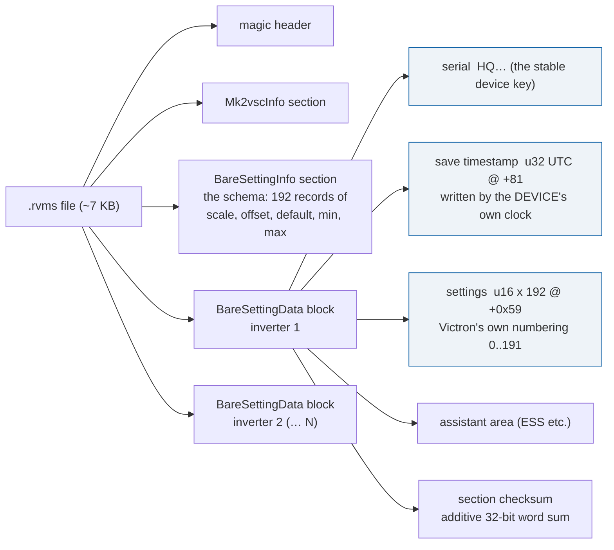

Four facts about the container that every later decision rests on:

- **One block per inverter, keyed by serial, not by position.** The two blocks swap file position between downloads of the same system. Anything that compares blocks must match them by serial.
- **Each block carries its own save timestamp, stamped by that inverter, in true UTC.** Within a pair the two stamps are 12 to 15 seconds apart because the GX services the units in sequence. The stamp records when the device produced the file. The device discards any stamp it is given and writes its own on the next download.
- **The schema travels with the file.** Scale, offset and range for every register come from the `BareSettingInfo` section, not from our tables. Across all 174 archived files and all 8 inverters there is exactly one schema signature, so the layout is uniform across the product line.
- **The checksum is per section and is a plain sum.** Any edit is "change the bytes, recompute the sum". There is no signature, no nonce, no sequence counter, and no expiry: a file back-stamped 1095 days old was accepted unchanged.

---

## 2. Download: what actually happens in time

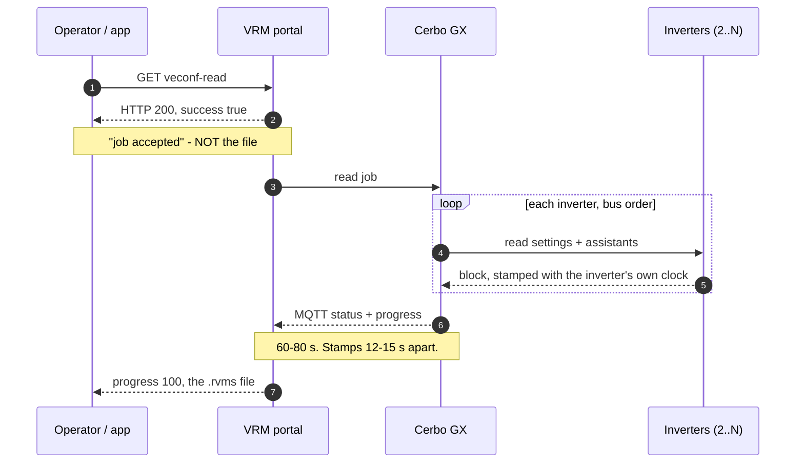

The outcome of a download, like an upload, arrives over the MQTT status topic rather than in the HTTP reply. The HTTP call only starts the job. A tool that stops at the `200` has learned nothing yet.

---

## 3. Upload: one call, three outcomes

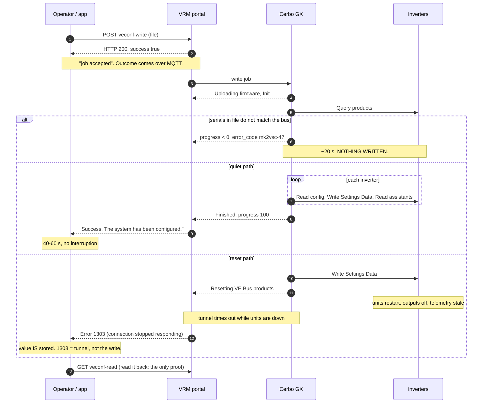

**The channel is thin.** Across a full successful write the status payload carried exactly two fields, `status` and `progress`. On failure it adds `error_message_code`, `error_message` and `error_code`. It never names an inverter. The stage block repeats once per unit, which is consistent with sequential service, but nothing in the payload maps a stage to a serial. Write order is recoverable afterwards from the per-block timestamps, not from the stream.

**What decides which path a write takes** (Observed):

| selector | acts | evidence |
|---|---|---|
| Serial match, before anything is written | refuses another system's file in ~20 s, `mk2vsc-47`, text names neither system | 1 of 1 |
| Container form | an upload-form (GUI-export) file runs the install procedure and resets *even with no changed value* | 3 of 3 upload-form, 0 of 22 device-form |
| The setting itself | disruption belongs to the individual register, not to its functional group | 15 settings quiet, 1 reset (11), on single-field writes |
| Per-register range | an out-of-range value is neither refused nor clamped: it is **dropped**, and the write takes the reset path | 3 of 3 |
| Exact bounds | a value at the schema min or max is an ordinary value | 1 upload, 2 registers |
| Cross-field consistency | **none**. A VS band with entry above return stored verbatim | 1 of 1 |
| File age | **not a gate** at 90 or 1095 days; the device rewrites its own stamp | 2 of 2 |
| Pair parity | **not enforced by the device**. One-sided writes store on one unit | 1 controlled write |

---

## 4. The system as a state machine

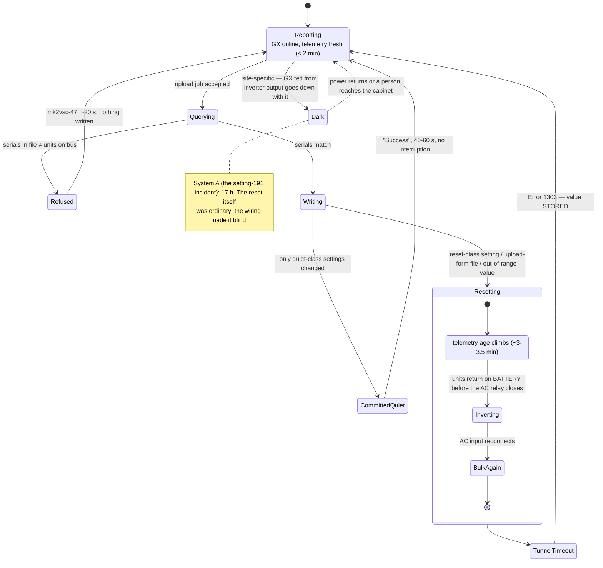

Two states deserve emphasis because they are where the human misreads happen:

- **TunnelTimeout is not a failed write.** On both the write and the revert of setting 11, the dialog ended in Error 1303 and the value was stored correctly on both inverters. A person who sees "Error" and uploads again is resetting the system a second time for nothing.
- **Inverting is a real exposure window.** After a reset the inverters come back before the AC input relay re-closes, so for a short period the unit runs on battery. At high state of charge that is invisible. At low state of charge it is the moment a marginal system could drop.

---

## 5. Timing, measured

*Times below are approximate to the 45 s poll interval.*

```mermaid
gantt
  title Reset-path upload, measured (setting 11, System D, 2026-09-11)
  dateFormat HH:mm:ss
  axisFormat %H:%M
  section Portal dialog
  Write Settings Data            :a1, 02:23:41, 1m43s
  Resetting VE.Bus products      :a2, 02:25:24, 4m03s
  Error 1303                     :milestone, m1, 02:29:27, 0s
  section Inverters
  running                        :b1, 02:23:41, 2m30s
  restart, outputs off           :crit, b2, 02:26:11, 5s
  Inverting (on battery)         :b3, 02:26:16, 46s
  Bulk again (grid back)         :b4, 02:27:02, 2m30s
  section Telemetry
  stale, age climbing to ~200 s  :c1, 02:24:00, 3m02s
  fresh again                    :c2, 02:27:02, 2m30s
  section Verification
  re-download shows value stored :d1, 02:29:34, 1m20s
```

| path | dialog sequence | wall time | telemetry |
|---|---|---|---|
| quiet | Query products → Read config → Write Settings Data → Read assistants (×N) → Finished | 40-60 s | never gaps |
| reset | Write Settings Data → Resetting VE.Bus products → Error 1303 | ~6 min | ~3-3.5 min gap, then recovers |
| refusal | Query products → error | ~20 s | never gaps |

Reverting a quiet change is quiet. Reverting a reset change resets again: the true cost of touching a reset-class register is two outages.

---

## 6. The decisions the software makes

**6a. Gates on the file.** Every red box is a place the software stops without touching the device.

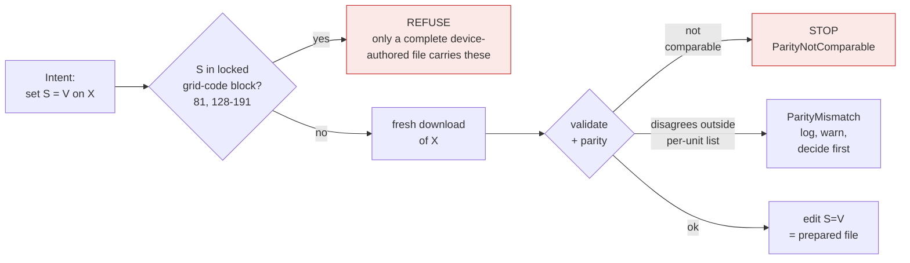

**6b. Gates on the run.** The prepared file is proven minimal, then the system is proven ready.

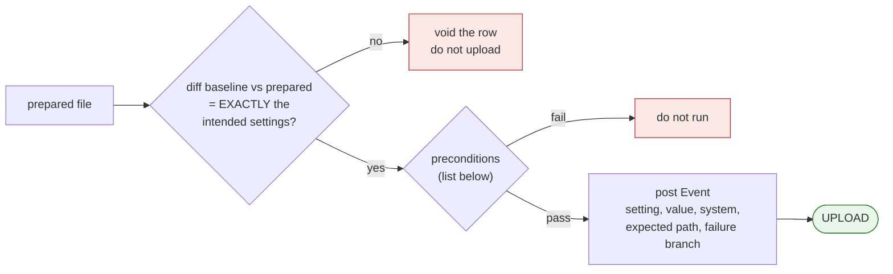

**6c. Classify the outcome.** The dialog only routes what happens next; it never decides success.

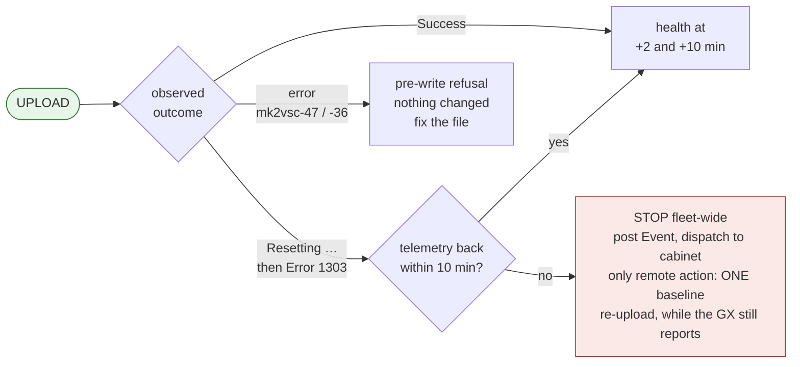

**6d. Verify, revert, record.** The read-back decides; the revert is verified the same way.

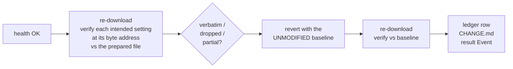

**Preconditions, every row:** system reporting fresh (under two minutes); VE.Bus state Bulk, Absorption or Float; VE.Bus error "No error"; AC input 1 Connected; SOC above 50 %; no other site in an incident; the expected path for S known. For a reset-path row additionally: the unit confirmed vacant, a person reachable at the cabinet, and knowledge of how that site's GX is powered.

**Why the verify step compares bytes at an address, not blocks.** The setting word and that block's save timestamp share a region, so any block-level hash differs after every write whether or not the value changed. Differencing baseline against prepared *before* upload yields exactly four changed offsets (one word per inverter plus two section checksums), which is the address to read back afterwards.

---

## 7. What the device checks, and what it leaves to us

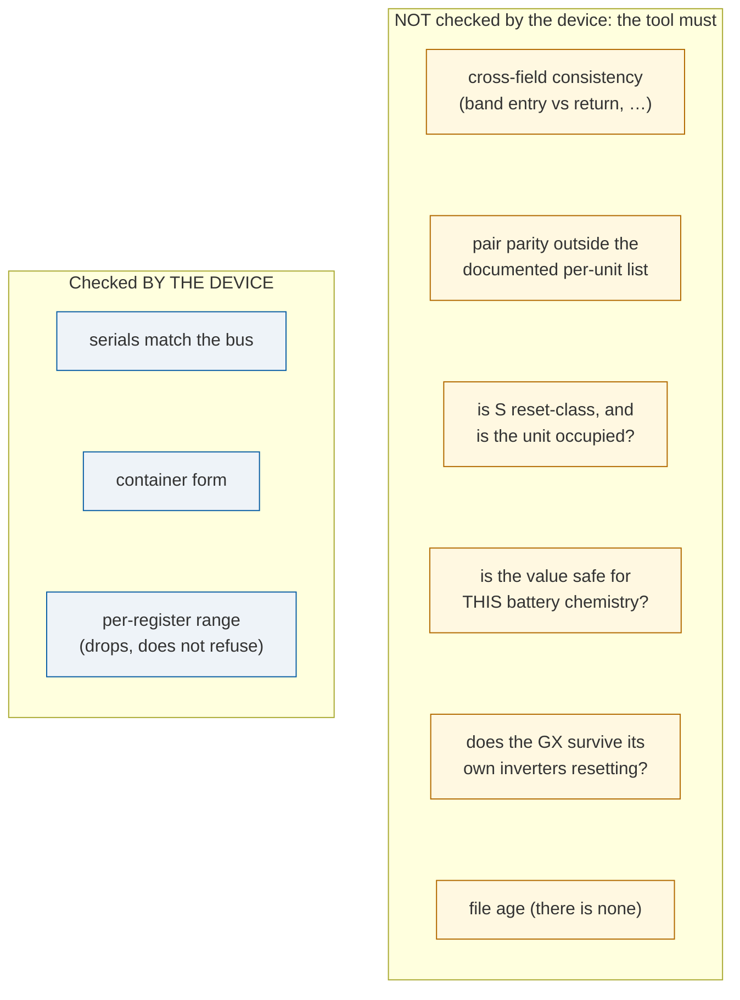

Silence from the first group is not agreement about anything in the second.

The line to remember: **the device is the range check of last resort and never the consistency check.** Everything the VEConfigure GUI enforces between fields, and everything about the physical system, is the tool's responsibility.

---

## 8. What a user must be told, per class of change

| class | what happens | what the tool must say |
|---|---|---|
| quiet setting (15 observed) | stored in under a minute, no interruption | "Applied. Read back and confirmed." |
| reset setting (11 observed; others Not established) | inverters off several minutes; 1303 at the end; revert resets again | "This will interrupt power. Do it when the unit is empty. The dialog will report an error; that is expected and does not mean it failed. Undo costs a second interruption." |
| load-visible setting (5, inverter output voltage) | stored, but **invisible in telemetry while the grid is present** because no output voltage is published | "Stored is not confirmed working. Every load sees this at the next outage." |
| grid-acceptance window (44–47) | safe range depends on a live grid-voltage measurement the platform does not publish | "Cannot be changed safely from here. Needs an on-site measurement." — a refusal, not a warning |
| grid-code block (81, 128–191) | one-word write put both inverters in Fault and a GX offline for 17 h | never written except as a complete device-authored file |
| upload-form file | resets even with no changed value | treat as reset-class regardless of content |
| out-of-range value | silently dropped, and the write resets | range-check before upload; the device will not tell you |
| one-inverter write | stored on that unit alone | parity check on every read; a pair disagreeing on charge voltages is a commissioning error, not a choice |

---

## 9. Verification is the only truth

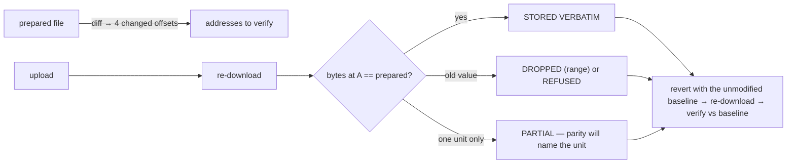

The dialog, the HTTP status, and the MQTT progress are all advisory. Two of them said "Error" on writes that succeeded. The file read back from the device is the only statement of what the device holds, and it is per inverter by construction.

---

## 10. Open unknowns, stated so they are not mistaken for facts

- The mechanism behind `mk2vsc-36` ("Incorrect grid code password or old configuration file"). Age is eliminated; a stale grid-code block is the leading reading; a save-counter is not ruled out.
- Whether the reset step cycles the inverters or only the bus. Both observations are confounded by site wiring.
- Which of the ~170 untested registers are reset-class. Fifteen are observed quiet, one observed reset. Disruption is per register, so nothing generalises to a neighbour.
- Three-phase (N > 2) behaviour of any of this. Every observation is on pairs.
- The GX power and network path on System B. Never traced; that system is barred from reset-path writes until it is.

---

## Rendering

Source of truth is this Markdown; the diagrams are mermaid fences, which GitHub renders directly. For a PDF: `tools/md2html.py docs/RVMS_MECHANICS.md out.html --title "RVMS mechanics"` produces a standalone page that loads mermaid from a CDN; render it with headless Chrome using `--virtual-time-budget=25000` so the diagrams finish drawing before print.
